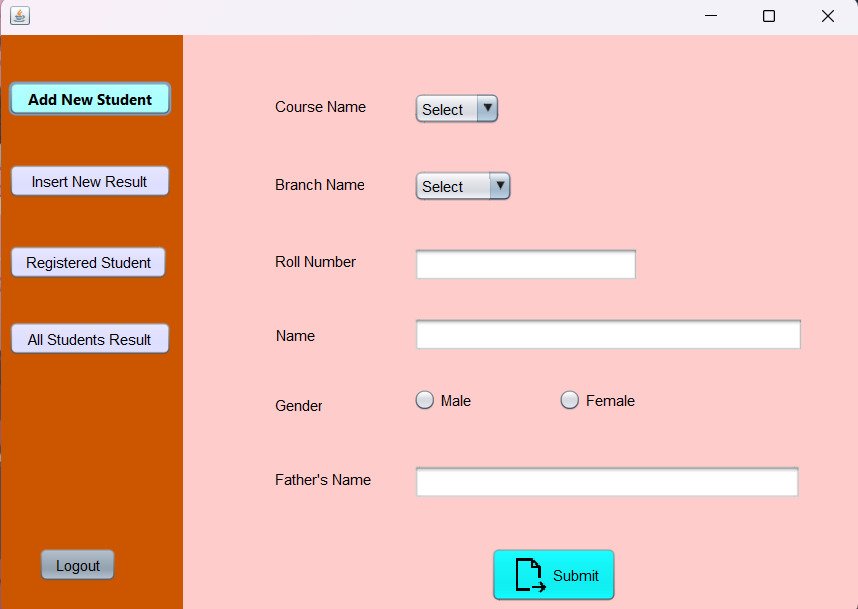

# 📌 STUDENT_RESULT_MANAGEMENT_SYSTEM :european_post_office:

* This project is a Student Result Management System that allows teachers and administrators to manage student marks and generate reports on student performance. The system also includes a student interface where students can view their marksheets and track their academic progress over time.

## :arrow_right: FEATURES
* Admin interface for adding and managing student marks
* Student interface for viewing marksheets and academic progress
* Security features to ensure authorized user access
* Reports and analytics on student performance
* User-friendly interface for teachers, administrators, and students

## :arrow_right: TECHNOLOGIES USED
* Java Swing
* MySQL

## :arrow_right: HOW TO USE
* :point_right: To use the Student Result Management System, follow these steps:

1. Clone the repository to your local machine.
2. Download the JDBC driver for MySQL and add it to your project's classpath.
3. Set up the MySQL database using the SQL script provided.
4. Run the system using the main class file.
5. Login as an administrator or student to access the respective interfaces.

### LOGGING IN
 When you run the system, you will be prompted to log in as either an administrator or a student.

* To log in as an admin, use the username "admin" and the password "pass".
* To log in as a student, use the student roll number  that were assigned to you by the administrator.

## :arrow_right: CODE STRUCTURE
* :point_right: The main components of the code are: 
    * 📍**adminindex**: The main JFrame that displays the options for students and admin.
    * 📍**studentadmin**: It provides an interface for adding a unique roll number for each student, which can be used to access their marksheet.
    * 📍**adminHome**: It provides an interface for the admin to access the system using their username and password. 
 
## :arrow_right: RESOURCES
* :point_right: I used some external resources for guidance :
   * [javaTpoint Java Swing Tutorial](https://www.javatpoint.com/java-swing).
   * [Oracle Java Swing](https://docs.oracle.com/javase/tutorial/uiswing/index.html).
   * [JDBC with MySQL](https://www.geeksforgeeks.org/java-database-connectivity-with-mysql/).
   * [MySQL JDBC Driver Download](https://dev.mysql.com/downloads/connector/j/).
 
## :arrow_right: SCREENSHOTS
### :point_right: Screenshot of Main Interface

### :point_right: Screenshot of Admin Portal Interface

### :point_right: Screenshot of Student Portal Interface

### :point_right: Screenshot of Admin Home Interface

### :point_right: Screenshot of Student Result Interface

 
 ## :v: ***Contributions are welcome! Feel free to submit pull requests or open issue and don't forget to give STAR🌟:!!***:relaxed:

 

    

